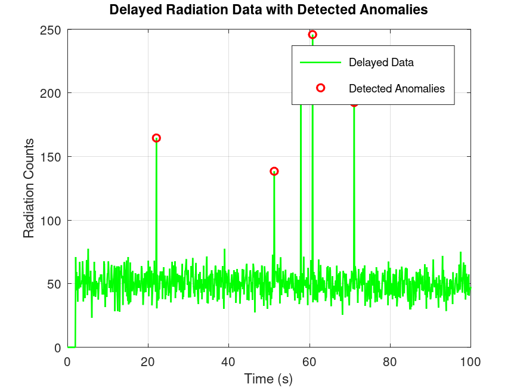
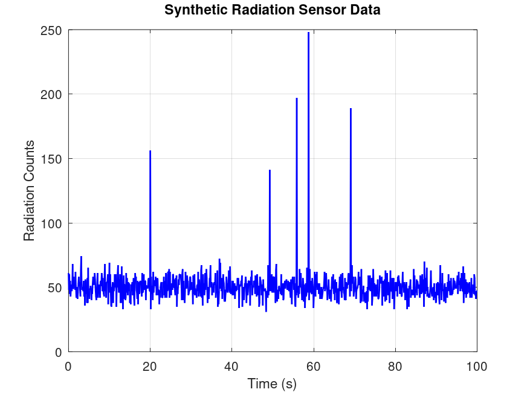
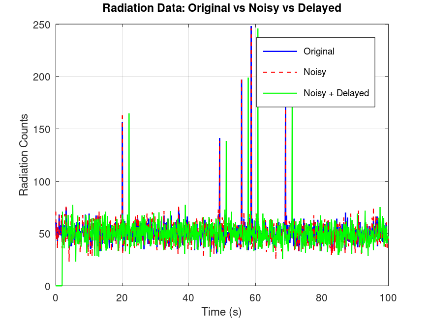

# Space Payload Data Simulation \& Analysis

Author: Keerthanaa Pathak
Date:18.09.2025

## Objective

Simulate and analyze synthetic radiation / planetary sensor data to model realistic satellite payload behaviour. The project generates time-series sensor readings, simulates transmission effects (noise, latency, and packet loss), and applies statistical and machine-learning methods to detect anomalies and evaluate simple mitigation strategies. Implementation and example results are provided in GNU Octave / MATLAB.

## Motivation

Modern satellites generate massive amounts of payload data from sensors such as radiation detectors, planetary imagers, and scientific instruments.  
Before this data can be used, it must be transmitted reliably to ground stations, where it is often corrupted by noise, latency, or missing packets.

By simulating payload data and transmission effects in software, this project demonstrates:

* Understanding of payload data characteristics.
* Awareness of communication challenges in space.
* Skills in data analysis, anomaly detection, and system modeling.

This knowledge is directly relevant to space technology research and applications.

## Methodology

The project is implemented in four main steps:

1. **Data Generation**

   * Synthetic radiation / planetary sensor data is generated.
   * A combination of base values, periodic variation, and random noise creates realistic time-series data.

2. **Transmission Simulation**

   * Effects such as communication noise, delays, and packet loss are modeled.
   * This simulates the challenges of sending data from a satellite to Earth.

3. **Data Analysis \& Anomaly Detection**

   * Statistical techniques (mean, standard deviation) are used to detect anomalies.
   * Plots highlight deviations and signal corruption.

4. **Extensions (Optional)**

   * Data compression and error-correction codes can be added.
   * AI/ML models can be used for advanced anomaly detection.

## Results

### Step 1: Radiation Noise Simulation
- Generated synthetic clean payload data and added random radiation-induced noise using a Poisson process.
- Compared clean vs. noisy signals visually.

**Plot:**  

---

### Step 2: Data Transmission Simulation
- Simulated satellite-to-ground transmission effects:
  - Fixed delay
  - Gaussian noise
  - Random dropouts
- Compared transmitted vs. received signals.

**Plot:**  

---

### Step 3: Anomaly Detection
- Applied a threshold-based detection method to flag abnormal deviations.
- Highlighted detected anomalies with red circles for clarity.
- Saved results for further analysis.

**Plot:**  

## Implementation Details (Step-by-step)

### Step 1 — Synthetic Radiation Data
**Purpose:** Generate realistic time-series data from a radiation/planetary sensor.  
**Approach:** Used a statistical process to model normal counts and added sudden spikes to simulate solar particle events.  
**Output:**  
- Data file: `data/radiation_data.mat`  
- Plot: 

---

### Step 2 — Transmission Simulation
**Purpose:** Simulate the satellite-to-ground transmission channel.  
**Approach:** Added Gaussian noise, applied a fixed delay, and introduced occasional dropouts to mimic real communication effects.  
**Output:**  
- Data file: `data/transmission_data.mat`  
- Plot: 

---

### Step 3 — Anomaly Detection
**Purpose:** Detect abnormal events in the received (noisy, delayed) data.  
**Approach:** Applied a simple threshold-based anomaly detection method to flag extreme deviations.  
**Output:**  
- Data file: `data/anomalies_detected.mat`  
- Plot: 

## Project Structure

Space_Payload_Data_Simulation/
│── code/ # MATLAB/Octave scripts
│ ├── radiation_simulation_step1.m
│ ├── transmission_simulation_step2.m
│ └── anomaly_detection_step3.m
│
│── data/ # Saved datasets
│ ├── radiation_data.mat
│ ├── transmission_data.mat
│ └── anomalies_detected.mat
│
│── plots/ # Generated plots
│ ├── radiation_data.png
│ ├── radiation_transmission.png
│ └── delayed_data_anomalies.png
│
│── README.md # Documentation

## Conclusion

This project successfully simulated satellite payload data, modeled realistic transmission effects, and applied basic anomaly detection.  
Through this step-by-step approach, we demonstrated how payload data can be generated, distorted during transmission, and then analyzed for faults.  

The work provides a foundation for more advanced extensions, such as:
- Incorporating real NASA/ESA datasets
- Implementing error-correction codes
- Applying AI/ML methods for anomaly detection

This simulation highlights both the challenges and potential solutions in handling space payload data, making it a valuable learning exercise for space technology applications.

